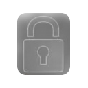

# Reflexões sobre Segurança em TI

Este repositório contém experimentos, demonstrações e textos sobre segurança na área de Tecnologia da Informação. Embora
eu esteja demonstrando como "burlar" algumas regras, em hipótese nenhuma eu recomendo que você que me lê descumpra
quaisquer leis. Este repositório é parte do meu portfolio. Este documento foi escrito em 2025.

[![Licença][shieldLicense]](LICENSE.txt)

## Índice

1. Segurança Cibernética
   1. [Acesso não autorizado ao Linux](hack-linux/README.md)
   2. [Vazamento de senhas](hack-senhas/README.md)
   3. Ensaio sobre [Segurança by Design](Segurança/README.md)
2. [Sobre Mim](#sobre-mim)
3. [Agradecimentos e Contato](#agradecimentos-e-contato)
4. [Licença](#licença)

## Sobre Mim

Sou pós graduado em Engenharia de Software, moro no Vale do Paraíba e tenho duas certificações Azure:

- Microsoft Certified: Azure Fundamentals
- Microsoft Certified: Azure Data Fundamentals

(<a href="#header">voltar ao topo</a>)

## Agradecimentos e Contato

Nós temos orgulho de ser _Powered by Open Source Community_:

- Fale conosco [via Discussion](https://github.com/portfolio-2026br/security/discussions):\
  

(<a href="#header">voltar ao topo</a>)

## Licença

GNU General Public License v2.0.

(<a href="#header">voltar ao topo</a>)

<!-- markdownlint-enable MD033 -->

[shieldLicense]: https://img.shields.io/badge/License-GPL%20v2-blue.svg?label=Licen%C3%A7a
