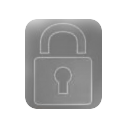

# Reflexões sobre Segurança em TI

Este repositório contém experimentos, demonstrações e textos sobre segurança na área de Tecnologia da Informação. Embora
eu esteja demonstrando como "burlar" algumas regras, em hipótese nenhuma eu recomendo que você que me lê descumpra
quaisquer leis. Este repositório é parte do meu portfolio. Este documento foi escrito em 2025.

[![Licença][shieldLicense]](LICENSE.txt)

## Índice

1. Segurança Cibernética
   1. O [elo mais fraco](#o-elo-mais-fraco)
   1. Acesso [não autorizado](hack-linux/README.md) ao Linux
   1. [Vazamento de senhas](hack-senhas/README.md)
   1. Ensaio sobre [Segurança by Design](Segurança/README.md)
   1. Ensaio sobre [Manter-se Vigilante](Vigilante/README.md)
2. [Agradecimentos e Contato](#agradecimentos-e-contato)
3. [Licença](#licença)

## O Elo Mais Fraco

Embora você leia em toda parte que o `fator humano`, ou seja, o `usuário` é o elo mais fraco da segurança, irei
argumentar que a falta de procedimentos aliada ao `salve-se quem puder` que existe no dia-a-dia das empresas é razão
suficiente para mover os usuários para posição de menos destaque nesta lista de culpados. Vejamos, em cada caso de falha
de segurança e vazamento de dados:

- qual o procedimento **DOCUMENTADO** que o usuário deveria seguir e falhou?
- o princípio do privilégio mínimo foi aplicado pela empresa? Ou o funcionário tem acesso a coisas que nem ele sabe como
  lidar?
- as ferramentas necessárias para bloquear o vírus, o malware, ..., estão ativas e atualizadas?
- o computador da empresa acessa **EXCLUSIVAMENTE** sites relacionados ao trabalho (e ao bem estar do trabalhador)?
- em caso de dúvidas, existem times treinados de suporte ao funcionário **ANTES** que ele faça algo inadequado à
  segurança dos dados da empresa?

Um dos maiores hospitais do Brasil publica uma planilha com dados de pacientes no GitHub, aí alguém culpa o estagiário e
fica por isto mesmo? Lamento, mas isto comprova que:

- procedimentos falharam ou nem existem;
- o que o estagiário fazia com a planilha e o GitHub ao mesmo tempo?
  - quem mexe com código na maioria das vezes não precisa de acesso a dados reais.
- e que a fiscalização, inclusive a cobrança necessária vinda dos clientes que tiveram seus dados vazados, falhou.

> [!IMPORTANT]
>
> Usuários precisam ser capacitados, treinados e conscientizados sobre seu papel no processo de proteção das informações
> da organização.

Capacitar, treinar e conscientizar não é uma coisa que se faz uma única vez para lançar as horas na planilha do pessoal
de TI ou RH. Isto tem que ser **a cultura da empresa**.

Depois que a empresa organizar os dados, ajustar permissões e limitar acesso, restringir o que pode aparecer dentro da
caixa de mensagens de cada usuário, aí este usuário não estará mais distraído fazendo malabarismo com serras elétricas.
Deste ponto em diante, a gente pode acusá-lo com mais convicção.

## Agradecimentos e Contato

Nós temos orgulho de ser _Powered by Open Source Community_:

- Fale conosco [via Discussion](https://github.com/portfolio-2026br/security/discussions):\
  

(<a href="#header">voltar ao topo</a>)

## Licença

GNU General Public License v2.0.

(<a href="#header">voltar ao topo</a>)

<!-- markdownlint-enable MD033 -->

[shieldLicense]: https://img.shields.io/badge/License-GPL%20v2-blue.svg?label=Licen%C3%A7a
