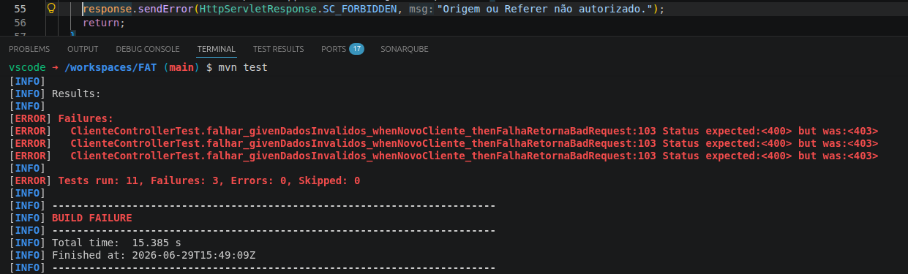
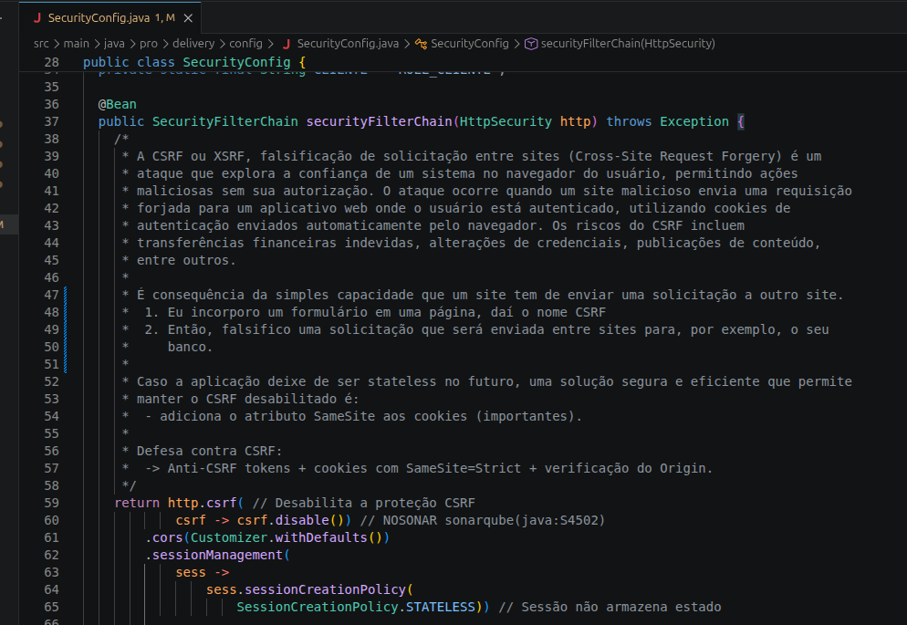
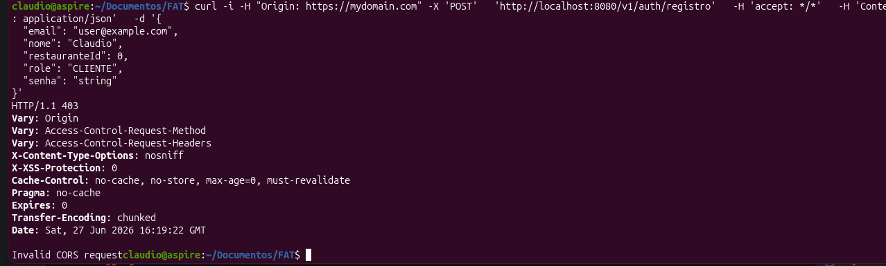

# Reflexões Sobre Segurança by Design

Evidências que comprovam minha experiênca com o projeto e implementação de boas práticas de segurança no desenvolvimento
de software.

## Contexto

Todo o time de desenvolvimento deve se envolver em propor e projetar soluções de software que sejam seguras e
resilientes.

A segurança defensiva envolve a implementação de várias barreiras de defesa, como programação defensiva, firewalls,
criptografia e monitoramento, que em conjunto tornam-se uma defesa rigorosa e robusta.

Portanto, em nosso projeto `portfolio em Java` além do controle de acesso com JWT, implementamos o CORS, e acrescentamos
ao backend Java a checagem dos cabeçalhos de requisição `HTTP Origin` e `HTTP Referer`.

### Nossas Razões

Como uma estratética limitada de proteção contra CSRF alguns servidores validam o campo Referer e/ou Origin para
verificar se uma solicitação se originou de um domínio confiável. Isto não é infalível, já que os cabeçalhos podem ser
falsificados ou omitidos. Ainda assim, os Browsers bloqueiam a adulteração destes campos por medida de segurança.
Portanto, esta é uma medida que fornece proteção contra eventos que possam ocorrer com usuários comuns que usam Browsers
de mercado.

## Solução

Pontos a destacar na minha solução:

### Segurança by Design

Segurança é uma parte integral de todo o processo de desenvolvimento.

- Acrescentar ao backend Java a checagem dos cabeçalhos de requisição `HTTP Origin` e `HTTP Referer`.

- Se o `HTTP Origin` ou `HTTP Referer` não forem provenientes de uma origem confiável (o próprio site onde o aplicativo
  está hospedado ou um parceiro), a solicitação é negada antes de ser processada e o servidor retorna 403 Forbidden:

- Nem mesmo os testes funcionam se a validação do `HTTP Origin` ou `HTTP Referer` não for aceitável:

- O CRSF pode ser desabilitado se a aplicação não for acessada via Browsers ou não usar cookies. Nossa aplicação
  `portfolio em Java` é stateless, com autenticação via Bearer JWS no cabeçalho:

- Habilitar o CORS altera os cabeçalhos que são enviados ao Browser. Mesmo que nossa API não tenha, no momento, nenhum
  aplicativo web relacionado, habilitar o CORS a prepara para possíveis casos de uso futuros envolvendo clientes que
  usam o navegador:

